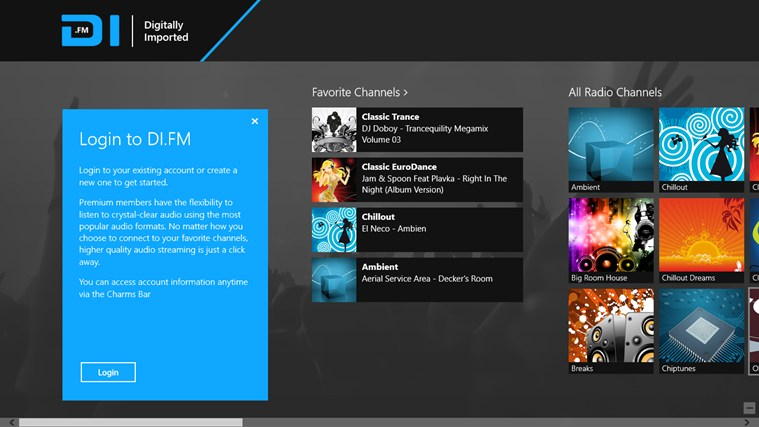
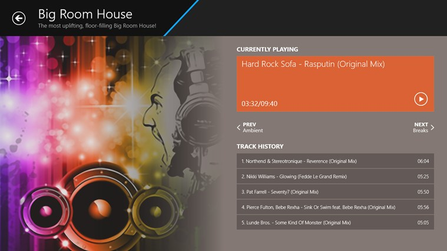
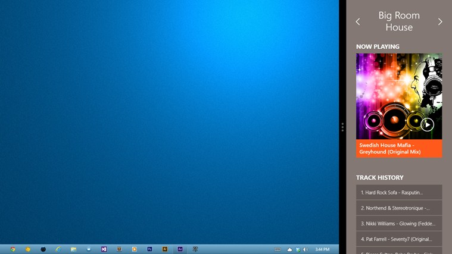

A Digitally Imported Radio App built for Windows 8 exclusively. The major motivation behind this project was to create a great app for listening to DI Radio on Windows 8 since no such app existed. While DI.FM provides a great experience via various apps on iOS, Android, and even Blackberry Windows Phone and Windows 8 were sorely lacking and in need of a great app themself.

