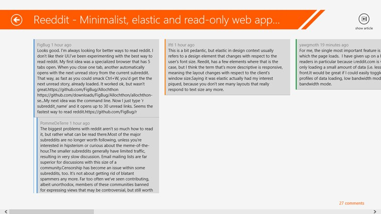
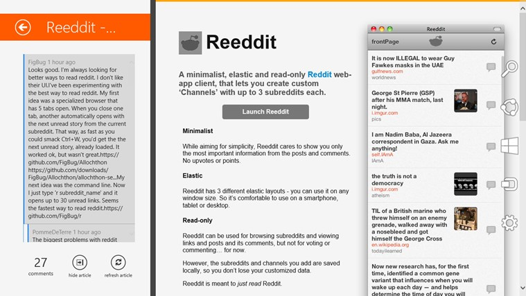

HackerNews Reader was an awesome project/product that was executed on very shortly after the Windows 8 release.
There was a surprising lack of any HN Reader on the Windows 8 App Store and this filled that void!

