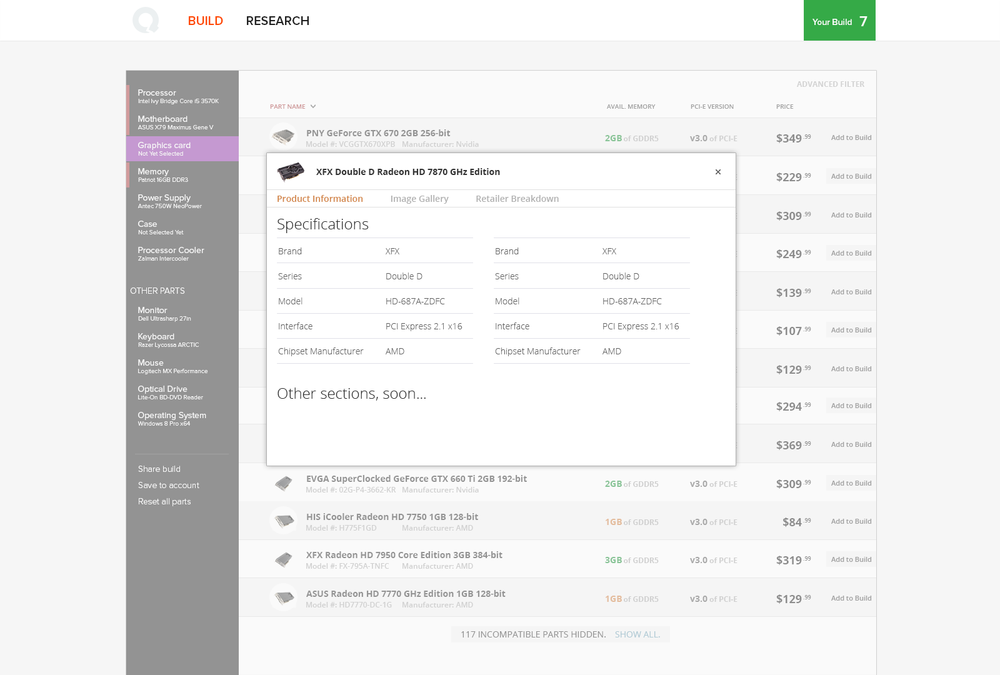
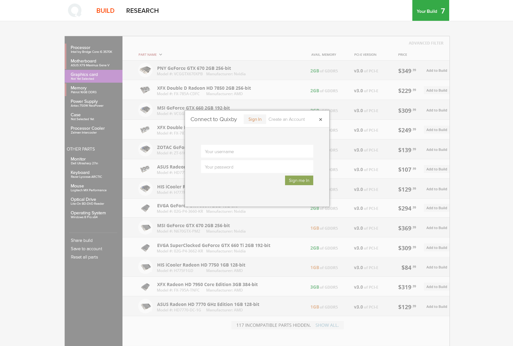
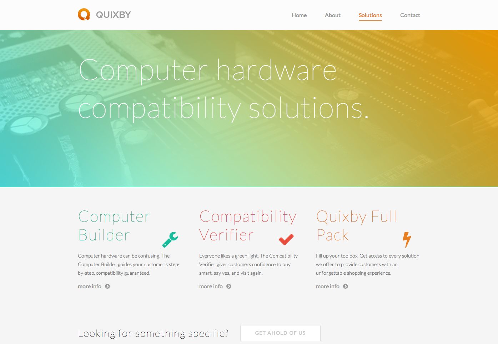
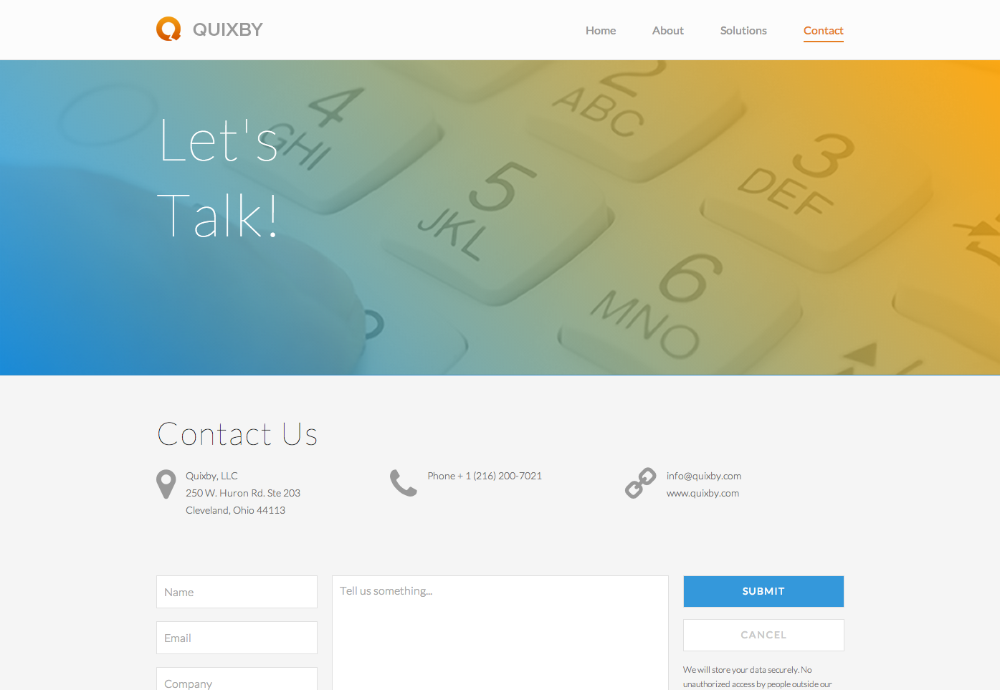

Quixby is a web app designed to simplify the process of selecting computer hardware components. Specifically, Quixby aggregates computer hardware inventory from various online computer parts retailers. Quixby provides users a next-generation interface that guides you through each computer part necessary for a full computer, however after each part you select, Quixby intelligently filters out incompatible parts in the following
categories you load.

## The Refreshed Quixby Website
As part of our effort to refocus and sell B2B we (Quixby) redesigned and relaunched our website. The goal was to present a clean but very future modern feel; which I believe we accomplished quite well.

